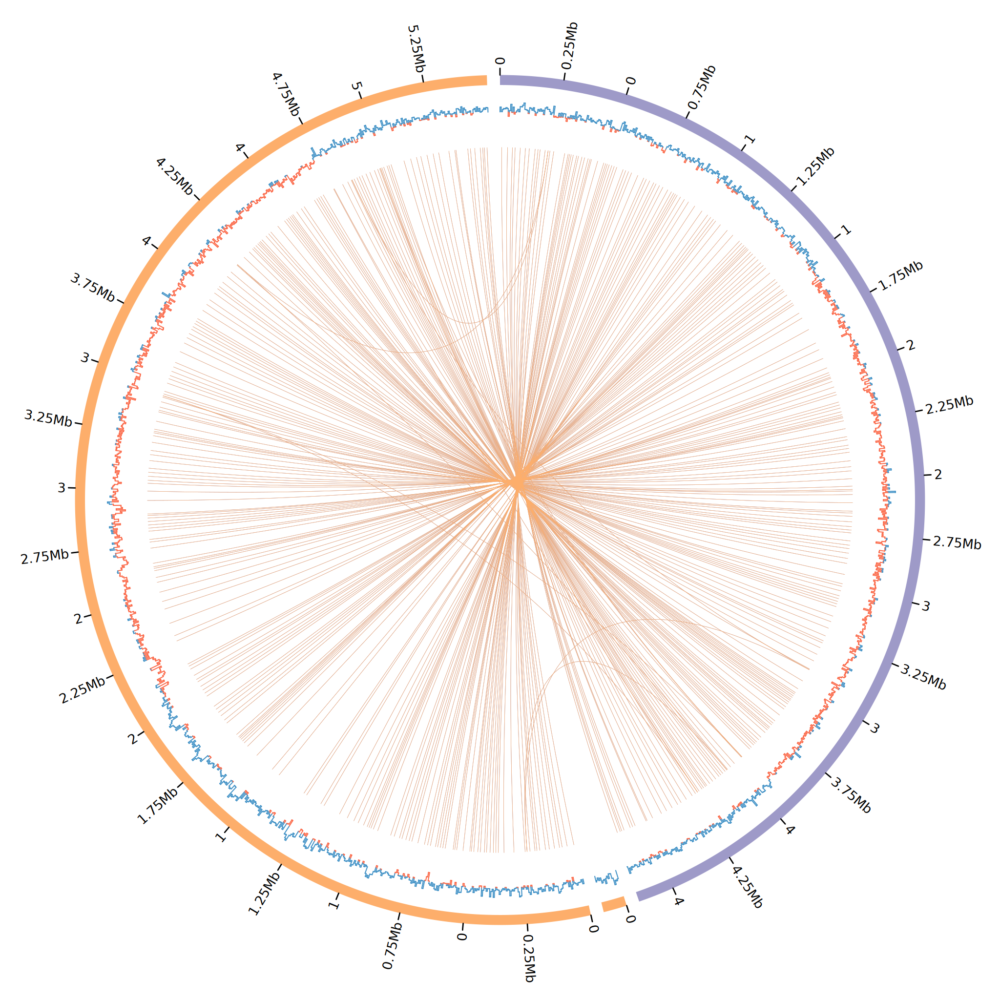

.. _quickstart:

Quickstart
==========

Minimal example
---------------

Get the data
""""""""""""

To keep things simple and reproducible, let's work with the reference *E. coli* genomes `K12 <https://www.ncbi.nlm.nih.gov/genome?LinkName=nuccore_genome&from_uid=545778205>`_ and `Sakai <https://www.ncbi.nlm.nih.gov/assembly/GCF_000008865.2>`_:

.. code-block:: bash

   ## download ecoli genome Sakai
   wget \
    https://ftp.ncbi.nlm.nih.gov/genomes/all/GCF/000/008/865/GCF_000008865.2_ASM886v2/GCF_000008865.2_ASM886v2_genomic.fna.gz \
    -O ecoli_sakai.fna.gz && \
   gzip -d ecoli_sakai.fna.gz

   ## download ecoli genome K12
   wget \
    https://ftp.ncbi.nlm.nih.gov/genomes/all/GCF/000/005/845/GCF_000005845.2_ASM584v2/GCF_000005845.2_ASM584v2_genomic.fna.gz \
    -O ecoli_k12.fna.gz && \
  gzip -d ecoli_k12.fna.gz

Prepare input
"""""""""""""

Before running the script, we must prepare the CSV that is used as input. This CSV must have:

* <FASTA PATH>,<PREFIX>,<COLOR>

We can prepare this csv with:

.. code-block:: bash

   echo "ecoli_k12.fna,K12,purple" > input.fofn
   echo "ecoli_sakai.fna,SAKAI,lorange" >> input.fofn

The file must look like this (input.fofn):

.. code-block:: bash

   ecoli_k12.fna,K12,purple
   ecoli_sakai.fna,SAKAI,lorange

Create the circos plot
""""""""""""""""""""""

With that, we can finally create a minimal circos configuration file and plots having:

* Ideograms
* Tick marks
* GC Skew
* Similarity links

.. code-block:: bash

   plot_circos --fofn input.fofn

This will create all the circos configuration files and required data files under the ``results`` folder (Can be changed with ``--outdir``). See the created plot:

.. note::

   Under the ``results/conf`` file you will have all the circos configuration plots. With that, you can further customize and increment the plot as you desire. For that, you must understand circos conf files. `See their manual <http://circos.ca/documentation/tutorials/configuration/configuration_files/>`_

Example with 2D tracks
----------------------
